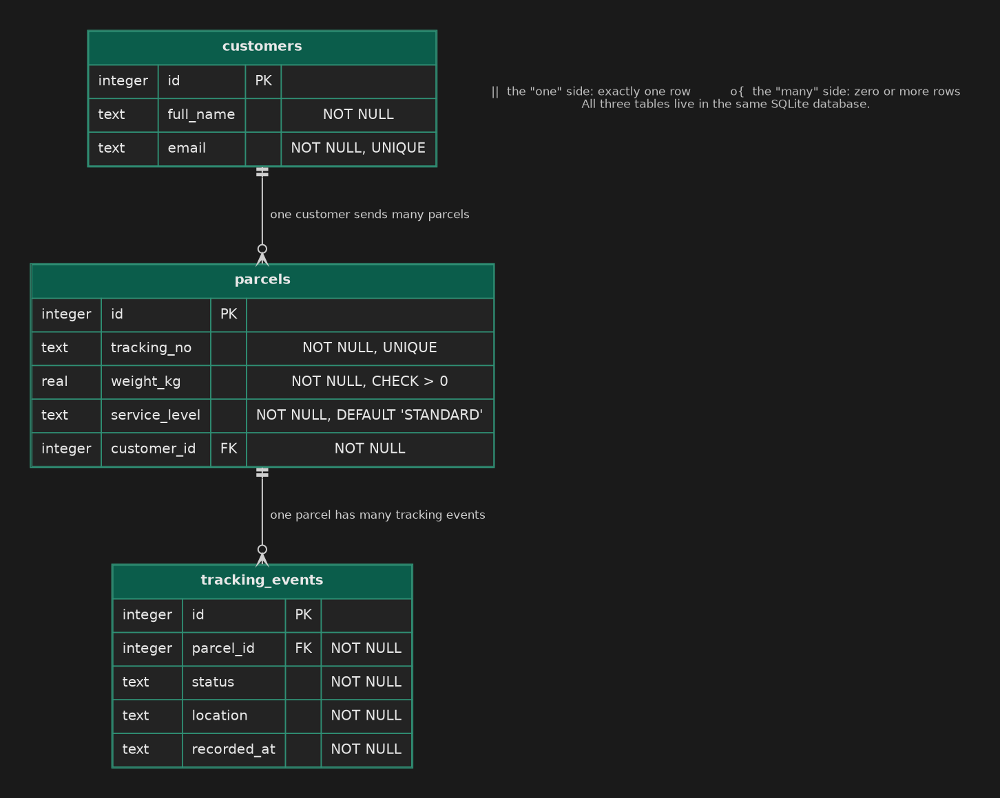

# Summative Assessment — SwiftParcel

## Learning Outcomes

| Learning Outcome | Section |
|---|---|
| Project Management / Agile Methodology | Section 1 |
| Brownfields Development | Section 2 |
| Testing | Section 3 |
| Systems Design | Section 4 |
| OOP | Section 5 |
| Build Pipelines / Scripting | Section 6 |
| Relational Databases | Section 7 |
| Web Development | Section 8 |

---

## Duration

**Total time: 3 hours 45 minutes**

| Section | Recommended Time |
|---|---|
| Section 1 — Agile Project Management | 20 minutes |
| Section 2 — Brownfields Development | 40 minutes |
| Section 3 — Testing | 30 minutes |
| Section 4 — Systems Design | 15 minutes |
| Section 5 — OOP | 15 minutes |
| Section 6 — Build Pipelines and Scripting | 30 minutes |
| Section 7 — Relational Databases | 35 minutes |
| Section 8 — Web Development | 40 minutes |

---

## Scoring

| Section | Marks |
|---|---|
| Section 1 — Agile Project Management | 12 |
| Section 2 — Brownfields Development | 16 |
| Section 3 — Testing | 12 |
| Section 4 — Systems Design | 10 |
| Section 5 — OOP | 8 |
| Section 6 — Build Pipelines and Scripting | 14 |
| Section 7 — Relational Databases | 14 |
| Section 8 — Web Development | 14 |
| **Total** | **100** |

---

## Before you start

You have inherited **SwiftParcel**, a small courier service: it quotes prices for parcels, models different shipment types, stores customers and parcels in a database, and has a web page where customers track their parcel. The code was written by someone who has since left the team.

**The project does not build yet.** Until it does, `mvn test` cannot run and Section 2 cannot be finished. Two tasks unblock the build, and you should do them first:

1. **Q6.2** — fix `pom.xml`
2. **Q5.1** — fix the class structure of the two shipment classes

The rest of the sections can be done in any order.

Write your written answers in `answers.txt`, under the matching question heading. **Do not change the format of the file or create a new one.**

Each section states which files you may edit. You may **never** modify an existing test, unless the question explicitly tells you to add tests.

---

# Section 1 — Agile Project Management

## Scenario

SwiftParcel's customers keep phoning the call centre to ask where their parcels are. The business wants a **Parcel Tracking** feature: a customer enters the tracking number printed on their parcel slip and sees where it has been.

The team of six (product owner, business analyst, tester and three developers) has worked in long, sequential phases until now: requirements are written first, then designed, then built, then tested weeks later. Releases are late, and the call centre has stopped believing delivery dates. You have been asked to set the team up to work in a time-boxed, iterative way before any code is written for this feature.

| Task | Marks | What earns marks |
|---|---|---|
| Q1.1 — Waterfall vs Agile | 4 | Accurate description of both (2), reasoning for why the switch benefits *this* team specifically (2) |
| Q1.2 — The sprint board | 4 | Columns cover the full journey from backlog to done in a sensible order (2), columns are distinct and each one is explained (1), a clear "definition of done" (1) |
| Q1.3 — Tickets and user stories | 4 | Correct user story format for each ticket (2), at least two testable Given/When/Then acceptance criteria per ticket (2) |

---

### Q1.1 — Waterfall vs Agile *(4 marks)*

Define the Waterfall model and Agile (time-boxed) delivery, and contrast them. Explain how moving from one to the other would help this team in the long run.

---

### Q1.2 — The Sprint Board *(4 marks)*

Design the columns of a sprint board (as you would set it up in GitLab or Jira) for this team. List them in order, left to right, and write one line per column explaining what it means for a ticket to be in it. Then write your team's **definition of done**.

> Do not use the default `Open` / `Closed` columns as your design.

---

### Q1.3 — Create the Tickets *(4 marks)*

Write the following two tickets. Under each, write a **user story** and **at least two acceptance criteria** in Given / When / Then form.

- **Ticket 1:** Track a parcel by tracking number
- **Ticket 2:** Unknown tracking number shows a helpful message

---

# Section 2 — Brownfields Development

| Task | Marks | What earns marks |
|---|---|---|
| Q2.1 — Brownfield vs Greenfield | 4 | Accurate contrast (1), what makes a project brownfield (1), two or more sensible steps before changing inherited code, with reasons (2) |
| Q2.2 — Refactoring for maintainability | 12 | Split across two methods, 6 each: correct identification and explanation of the maintainability problem (2), the refactor actually resolves it (2), existing tests pass unmodified — binary (1), justification is specific to your change (1) |

---

### Q2.1 — Brownfield vs Greenfield *(4 marks)*

Define and contrast brownfield and greenfield development. Then describe what you would do **before changing any code** in an inherited project like SwiftParcel, and why.

---

### Q2.2 — Refactoring for Maintainability *(12 marks)*

Somewhere in the codebase are **two methods**, each with a *different* maintainability problem in how its conditional logic is written. Both behave correctly today, and the existing tests prove it.

For each method, complete all three steps.

#### Q2.2.1 — Locate and describe the problem

Name the class and method. Say what is wrong with how it is structured (name the code smell if you can) and why that matters for readability, testing or safe modification. *(Write this in `answers.txt`.)*

#### Q2.2.2 — Refactor

Refactor the method to resolve the problem you identified. Its public signature and its behaviour must not change. You may add private helper methods and constants.

#### Q2.2.3 — Prove behaviour preservation

Run the existing test suite before and after your refactor:

```bash
mvn test
```

Your refactored code must pass every existing test **unchanged**. In `answers.txt`, write **3 to 5 sentences per method** justifying why your new structure is more maintainable than the original.

---

# Section 3 — Testing

| Task | Marks | What earns marks |
|---|---|---|
| Q3.1 — Kinds of tests | 3 | One mark per test correctly classified *and* justified |
| Q3.2 — Writing tests | 6 | Boundary tests at both ends of the weight rule (2), valid, invalid and `null` cases for the other methods (1), clear names with one behaviour per test and meaningful assertions (1), defect identified and explained in `answers.txt` (1), defect fixed and all your tests pass (1) |
| Q3.3 — Reading test reports | 3 | One mark for each of the three parts |

---

### Q3.1 — Kinds of Tests *(3 marks)*

Classify each of the following as a **unit**, **integration** or **acceptance** test, and justify your answer in one or two sentences.

1. `EconomyShipmentTest.deliveryFee_isRatePerKgTimesWeight`
2. `ParcelQueriesTest.latestStatusPerParcel_usesTheMostRecentEventOnly`
3. *"Given a customer is on the tracking page, when they enter a valid tracking number and submit, then they see each event for that parcel, newest first."*

---

### Q3.2 — Writing Tests *(6 marks)*

`ParcelValidator` decides which parcels SwiftParcel will accept, but its test class contains only one worked example. The rules are in the Javadoc at the top of `ParcelValidator.java`.

Open `ParcelValidatorTest.java` and add **at least six more tests**. Together they must cover:

- the weight rule, at **both boundaries** (each side of each limit)
- `isValidPostalCode` and `isValidTrackingNumber`: valid values, invalid values and `null`
- `chargeableWeight`, where the actual weight wins and where the volumetric weight wins
- at least one assertion on an **exception message**

Then run `mvn test`.

`ParcelValidator` contains **one defect**. Good tests will find it. If one of your tests fails because the production code is wrong (not because your test is wrong), then:

1. in `answers.txt`, name the test that exposed it and explain the defect;
2. fix the defect in `ParcelValidator.java`;
3. re-run `mvn test` and confirm everything passes.

> You may not edit the worked example that is already in the file.

---

### Q3.3 — Reading Test Reports *(3 marks)*

A teammate posts this from the pipeline and says *"green build, we're good to ship"*:

```
[INFO] Results:
[WARNING] Tests run: 48, Failures: 0, Errors: 0, Skipped: 9
[INFO] BUILD SUCCESS

Line coverage: 34%   (last week: 61%)
```

(a) What does `Skipped: 9` tell you, and why is `BUILD SUCCESS` not enough on its own to justify shipping?
(b) What does 34% line coverage tell you, and what does it *not* tell you?
(c) Why is it more useful to look at these numbers across many pipeline runs than at only the latest one?

---

# Section 4 — Systems Design

| Task | Marks | What earns marks |
|---|---|---|
| Q4.1 — System design | 4 | Accurate definition (1), what it aims to achieve (1), separation of concerns explained (1), applied to SwiftParcel's own parts (1) |
| Q4.2 — UML class diagram | 6 | Classes with sensible attributes and operations (2), inheritance and the abstract class shown correctly (2), associations with correct multiplicities (2) |

---

### Q4.1 — System Design *(4 marks)*

Define what system design (software design) is and what it aims to achieve. Then explain the principle of **separation of concerns**, using SwiftParcel's four parts as your example: the web page in the browser, the API, the `QuoteService` business logic, and the database.

---

### Q4.2 — UML Class Diagram *(6 marks)*

Before the tracking feature is built, draw a **UML class diagram** of the SwiftParcel domain. It must include:

- `Shipment` (abstract), `EconomyShipment` and `ExpressShipment`
- `Customer`, `Parcel` and `TrackingEvent`
- the relationships between them: a customer sends many parcels, a parcel has many tracking events, and the two shipment types specialise `Shipment`

Show two or three sensible attributes and operations per class, and the multiplicity at each end of every association.

Write your diagram as **PlantUML text** in `answers.txt` (or as plain-text art if you prefer). A small example of the PlantUML syntax, for a different domain:

```
@startuml
abstract class Vehicle {
  - registration : String
  + wheels() : int
}
class Bicycle
Vehicle <|-- Bicycle
Owner "1" --> "0..*" Vehicle : owns
@enduml
```

---

# Section 5 — OOP

| Task | Marks | What earns marks |
|---|---|---|
| Q5.1 — Fix the OOP structure | 4 | Correctly identifies each issue (2), correctly resolves each issue in both classes without changing any other logic (2) |
| Q5.2 — Abstraction and polymorphism | 4 | Why `Shipment` is abstract (1), where polymorphism happens in `Main` (1), adding `SameDayShipment` without touching existing classes (1), why that is a good design (1) |

---

### Q5.1 — Fix the OOP Structure *(4 marks)*

`EconomyShipment` and `ExpressShipment` do not compile. Each has a **different** structural problem. Read the compiler output, work out what is wrong in each class and fix it. Do not change any other logic.

> You may not modify the tests.
> This should take no more than 5 minutes once the build gets that far.

---

### Q5.2 — Abstraction and Polymorphism *(4 marks)*

Answer in `answers.txt`:

(a) Why is `Shipment` declared `abstract` rather than being an ordinary class?
(b) In `Main`, two variables of type `Shipment` are printed and each shows a different fee. Which OOP principle produces that behaviour, and how?
(c) The business wants a `SameDayShipment`. Describe what you would add and what, if anything, you would have to change in the existing classes. Why is this a good property for a design to have?

---

# Section 6 — Build Pipelines and Scripting

| Task | Marks | What earns marks |
|---|---|---|
| Q6.1 — Versioning a release | 3 | Correct version and sound reason for each of **(a)**, **(b)** and **(c)** (1 each) |
| Q6.2 — Fix the build | 3 | Correct Maven Central coordinates for the first dependency (1) and the second (1), each declared with the correct scope (1) |
| Q6.3 — Build a pipeline | 4 | Stages defined in the correct order (1), `test` job in its own stage running the matching Makefile target (1), test results published as a report even when tests fail (1), `package` job keeps the jar as an artifact and runs only on the default branch (1) |
| Q6.4 — Release script | 4 | Argument handling (1), version validation (1), runs tests then packages, and stops if either fails (1), publishes the jar and prints the ready message (1) |

---

### Q6.1 — Versioning a Release *(3 marks)*

SwiftParcel is currently released at version `2.3.1`. Each change below is made **independently**, starting from `2.3.1` every time. State the new version number and explain why.

- **(a)** You fix a defect in how the surcharge is calculated. No public methods change.
- **(b)** You add a new public method to `QuoteService`. Nothing existing changes.
- **(c)** You rename a public method that other teams already call.

---

### Q6.2 — Fix the Build *(3 marks)*

`pom.xml` is missing **two** dependencies. Running `mvn compile` or `mvn test` tells you what cannot be found, for example `package com.google.gson does not exist`. Work out which library each error points to, find its coordinates on [Maven Central](https://mvnrepository.com/repos/central) and add it.

- One library is needed by the application's own code at runtime.
- The other is needed only when running the tests. The `junit.version` property is already defined in `pom.xml`; use it.

Declare each with the **correct scope**.

---

### Q6.3 — Build a Pipeline *(4 marks)*

The project builds on GitLab CI. The pipeline is defined in `.gitlab-ci.yml` and calls the same `Makefile` targets you use locally. The image and the `build` job are provided as a worked example.

Complete the pipeline so that:

1. `stages` are defined for **build**, **test** and **package**, in that order;
2. a `test` job in the `test` stage runs `make test`, and its JUnit XML results (Surefire writes them to `target/surefire-reports/`) are published as a **test report**, **even when the tests fail**;
3. a `package` job in the `package` stage runs `make package`, keeps the built jar (`target/*-jar-with-dependencies.jar`) as an artifact that expires after one week, and runs **only on the default branch**.

> You are allowed to use the [CI/CD YAML reference](https://docs.gitlab.com/ci/yaml/).

---

### Q6.4 — Release Script *(4 marks)*

Write `scripts/release.sh`. Usage: `./scripts/release.sh <version>`

| Situation | Required behaviour |
|---|---|
| No argument | Print `Usage: release.sh <version>` to **stderr** and exit with status **2**. Build nothing. |
| Version is not `MAJOR.MINOR.PATCH` (digits only, e.g. `1.4.2`) | Print `Invalid version: <the value>` (you may add more text after it) to **stderr** and exit with status **1**. Build nothing. |
| Valid version | Run `make test`, then `make package`. If either fails, the script must stop immediately with a non-zero status and publish nothing. Then create `dist/` if needed, copy `target/swiftparcel-jar-with-dependencies.jar` to `dist/swiftparcel-<version>.jar`, and print `Release <version> ready in dist/` |

Start the script with a `#!/usr/bin/env bash` line and make it fail fast on errors and on unset variables.

Check your work with the provided self-check, which runs your script against a fake `make` so nothing is really built:

```bash
./scripts/check-release.sh
```

---

# Section 7 — Relational Databases

## Scenario

SwiftParcel currently keeps everything in memory. The next step is to persist **customers**, **parcels** and each parcel's **tracking events** in a SQLite database. `resources/erd.png` is the entity relationship diagram:



`Database.connect(path)` is provided. `DatabaseSchema.createSchema(Connection)` and the SQL in `ParcelQueries` are empty. (SQLite does not enforce foreign keys unless asked to; `Database.connect` already turns enforcement on for you.)

> `resources/SQL-Cheat-Sheet.pdf` is provided as a reference for SQL syntax.

| Task | Marks | What earns marks |
|---|---|---|
| Q7.1 — Keys and structure | 3 | Primary and foreign keys defined (1), why events live in their own table (1), what foreign key enforcement prevents (1) |
| Q7.2 — Create the schema | 6 | `customers` table correct (2), `parcels` table correct including `UNIQUE`, `DEFAULT` and `CHECK` (2), `tracking_events` table and both foreign keys correct (2) |
| Q7.3 — Write the queries | 5 | Query (a) (1), query (b) (2), query (c) (2) |

---

### Q7.1 — Keys and Structure *(3 marks)*

In `answers.txt`:

(a) Define a **primary key** and a **foreign key**.
(b) A colleague suggests skipping the `tracking_events` table and adding one text column, `history`, to `parcels`, storing every event as one comma-separated string. Give the strongest reason that the ERD's design is better.
(c) What kind of bad data does an enforced foreign key stop from ever entering the database?

---

### Q7.2 — Create the Schema *(6 marks)*

Implement `DatabaseSchema.createSchema(Connection connection)` so that it creates all three tables **exactly as shown in the ERD**, using one `CREATE TABLE` statement per table, in an order in which every foreign key points at a table that already exists. Every constraint in the ERD must be declared: primary keys, foreign keys, `NOT NULL`, `UNIQUE`, `DEFAULT` and `CHECK`.

> Schema creation only. Do not insert or query any data here.
> Run `mvn test` to check your schema against `DatabaseSchemaTest`.

---

### Q7.3 — Write the Queries *(5 marks)*

Complete the three SQL constants in `ParcelQueries.java`. Each is described in the Javadoc above it, and the column names your query returns matter. `ParcelQueriesTest` seeds a small database and checks each one. (It needs a correct Q7.2 to pass.)

- **(a)** All parcels belonging to one customer *(1 mark)*
- **(b)** The number of parcels per customer, including customers who have none *(2 marks)*
- **(c)** The status of each parcel's most recent tracking event *(2 marks)*

---

# Section 8 — Web Development

## Scenario

The tracking page lives in `web/`: `index.html`, `styles.css` and `app.js`. The page is wired up for you: when the form is submitted, `app.js` calls your `fetchTracking`, then either your `renderEvents` or an error message. Your job is to make the four pieces work.

The page talks to this API (already built by another team):

```
GET /api/parcels/{trackingNo}/events
  200 OK        -> [ { "status": "IN_TRANSIT", "location": "Bloemfontein", "recordedAt": "2026-09-02T10:00:00" }, ... ]
  404 Not Found -> no parcel has that tracking number
```

Check your work with:

```bash
make web-test        # runs: node --test web/test/app.test.js  (Node 20+)
```

To try the page by eye, open `web/index.html` in a browser (the API itself is not running, so expect the network error message).

| Task | Marks | What earns marks |
|---|---|---|
| Q8.1 — Semantic, accessible HTML | 3 | Landmarks and language (1), labelled, validated tracking number input and submit button (1), results region announced to assistive technology (1) |
| Q8.2 — Responsive CSS | 2 | Flexbox layout with a media query that stacks the cards on small screens (1), a distinct colour for each status (1) |
| Q8.3 — JavaScript | 6 | `escapeHtml` (1), `formatStatus` (1), `renderEvents` (2), `fetchTracking` (2) |
| Q8.4 — HTTP, REST and security | 3 | REST route design (2), why untrusted text must be escaped (1) |

---

### Q8.1 — Semantic, Accessible HTML *(3 marks)*

Edit `index.html` (only) so that:

1. the `<html>` element declares the page language as English, and the generic `<div class="header">` and `<div class="content">` wrappers are replaced by the `<header>` and `<main>` landmark elements;
2. the form contains a `<label>` linked to a text `<input>` with `id="tracking-no"` and `name="trackingNo"`. The input is **required** and must match a tracking number: `SP` followed by eight digits, using the HTML `pattern` attribute. The form also contains a submit button;
3. `<div id="results">` becomes a `<section>` that keeps `id="results"` and tells screen readers to announce changes politely.

---

### Q8.2 — Responsive CSS *(2 marks)*

Edit `styles.css`:

1. lay the `.events` list out with **flexbox** so the `.event` cards sit side by side and wrap onto new lines; below **600px** wide, stack them in a single column using a media query;
2. give `.status-collected`, `.status-in_transit` and `.status-delivered` each their own colour.

---

### Q8.3 — JavaScript *(6 marks)*

Implement the four functions in `app.js`. Do not change the page wiring at the bottom.

| Function | Required behaviour |
|---|---|
| `escapeHtml(text)` | Replace `&`, `<`, `>`, `"` and `'` with their HTML entities (`&amp;`, `&lt;`, `&gt;`, `&quot;`, `&#39;`). |
| `formatStatus(status)` | `'IN_TRANSIT'` → `'In transit'`: lower-case everything, replace underscores with spaces, capitalise the first letter. |
| `renderEvents(events)` | Return a string of HTML. If `events` is empty or missing: `<p class="empty">No tracking events yet.</p>`. Otherwise a `<ul class="events">` containing one `<li>` per event, in the order given: `<li class="event status-{status in lower case}">`, holding the formatted status in `<strong>`, the location in `<span class="location">`, and the time in `<time datetime="{recordedAt}">{recordedAt}</time>`. All text that comes from the event must be escaped. |
| `fetchTracking(trackingNo, fetchFn)` | Request `/api/parcels/{trackingNo}/events` (the tracking number URL-encoded) using `fetchFn`. Return `{ ok: true, events }` on success. On a **404** return `{ ok: false, error: 'Parcel not found' }`. On any other non-OK status return `{ ok: false, error: 'Something went wrong. Please try again.' }`. If the request itself throws (for example the network is down), return `{ ok: false, error: 'Network error. Check your connection and try again.' }`. The function must never throw. |

---

### Q8.4 — HTTP, REST and Security *(3 marks)*

In `answers.txt`:

(a) *(2 marks)* For each action below, give the HTTP method, a REST-style path and the status code(s) for success and for the failure that is described.

1. Fetch a parcel's tracking events. *Failure: no such parcel.*
2. Register a new parcel. *Failure: the request body is invalid.*
3. Record a new tracking event for an existing parcel. *Failure: no such parcel.*

(b) *(1 mark)* `renderEvents` puts text into a string of HTML that is later assigned to `innerHTML`. Explain what attack becomes possible if that text is not escaped, and who would be harmed.

---

### End of Assessment

---

## Project structure

```
swiftparcel-assessment/
  README.md
  answers.txt
  pom.xml
  Makefile
  .gitlab-ci.yml
  scripts/
    release.sh              (Q6.4 - you write this)
    check-release.sh        (self-check - do not edit)
  resources/
    erd.png
    SQL-Cheat-Sheet.pdf
  src/
    main/java/za/co/swiftparcel/
      Zone.java  Parcel.java  Depot.java  QuoteService.java
      Shipment.java  EconomyShipment.java  ExpressShipment.java
      ParcelValidator.java  ParcelJson.java  Main.java
      Database.java  DatabaseSchema.java  ParcelQueries.java
    test/java/za/co/swiftparcel/
      QuoteServiceTest.java  EconomyShipmentTest.java  ExpressShipmentTest.java
      ParcelValidatorTest.java  ParcelJsonTest.java
      DatabaseSchemaTest.java  ParcelQueriesTest.java
  web/
    index.html  styles.css  app.js
    test/app.test.js
```

## Useful commands

```bash
# Compile the source code
mvn compile

# Run the Java test suite
mvn test

# Package the application into a jar (skipping tests)
mvn package -DskipTests

# Run the packaged jar
java -jar target/swiftparcel-jar-with-dependencies.jar

# Run the web tests
node --test web/test/app.test.js

# Check your release script
./scripts/check-release.sh
```

The `Makefile` wraps these commands and is what the GitLab CI pipeline runs:

```bash
make compile
make test
make package
make web-test
```
